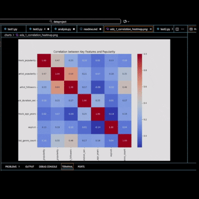

## Spotify Song Popularity Prediction Testing Model

A machine learning project focused on predicting the commercial success `track_popularity` of Spotify songs based on their intrinsic features and artist attributes.

##  Project Goal

To build and evaluate regression models (Random Forest, XGBoost) to understand which internal factors (e.g., artist popularity, track age) drive song popularity, and to what extent.
Data has been cleansed 

Data downloaded from kaggle

##  Key Findings

The final regression models achieved an R² score of approximately **0.38**, meaning only 38% of the song popularity variance can be explained by the provided dataset features. This indicates that external factors (marketing, social trends, virality) are the dominant drivers of a song's success.

| Model | RMSE (Average Error) | R² (Explained Variance) |
| :--- | :--- | :--- |
| **XGBoost** | **~19.15** | **~0.38** |
| Random Forest | ~19.28 | ~0.37 |

The low R² value (~0.38) is not a reflection of model error, but of the inherent difficulty of the problem using internal data. This demonstrates that over 60% of song popularity is driven by external, uncaptured factors 

### Critical Insight
The **Feature Importance** analysis (see chart in `/charts`) highlighted that Artist Followers and Artist Popularity are the strongest predictors, far outweighing objective audio features like energy or danceability.

  

